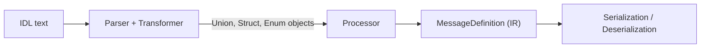

# Union Support in the Python OMGIDL Implementation

This document describes how the Python portion of **omgidl** parses, represents,
and serializes OMG IDL `union` definitions. It is derived from the current
implementation and includes a brief analysis of the intermediate representation
(IR) and potential improvements.

## Parsing

`omgidl_parser.parse` extends the Lark grammar to recognise `union` declarations
and their cases. The grammar rule defines the `union`, `case`, and optional
`default` clauses:

```idl
union: "union" NAME "switch" "(" type ")" "{" union_case+ "}" semicolon?
union_case: "case" case_predicates ":" field
          | "default" ":" field
case_predicates: const_value ("," const_value)*
```

The transformer builds a structured representation using dataclasses. Each case
stores its predicates and associated field, and the union keeps the discriminator
type, all cases, and an optional default field (see
[`omgidl_parser/parse.py`](../omgidl_parser/parse.py) lines 48–53 and 431–454).

## Conversion to Message Definitions

During processing, unions are converted into `IDLUnionDefinition` objects. The
conversion resolves the discriminator type, normalises enum discriminators to
`uint32`, and converts each case field into the common `MessageDefinitionField`
structure. Default cases are handled separately (see
[`omgidl_parser/process.py`](../omgidl_parser/process.py) lines 226–256).

## Intermediate Representation

The shared IR for structs, unions, and modules is defined in
`python_omgidl/message_definition`. A `MessageDefinition` includes a
`switchType`, a list of `cases`, and an optional `defaultCase` when its
`aggregatedKind` is `UNION` (see
[`message_definition/__init__.py`](../message_definition/__init__.py) lines 41–64).
Each `UnionCase` records the discriminator predicates and the field definition,
linking union semantics to the generic field representation.

### Data Flow



## Serialization and Deserialization

`DeserializationInfoCache` creates a `UnionDeserializationInfo` containing the
IDL union definition, flagging whether delimiter and member headers are used and
building default values for both the discriminator and selected case (see
[`omgidl_serialization/deserialization_info_cache.py`](../omgidl_serialization/deserialization_info_cache.py) lines 88–190).
`MessageReader` relies on this metadata to read the discriminator first and then
the matching case field, supporting both header styles (see
[`omgidl_serialization/message_reader.py`](../omgidl_serialization/message_reader.py) lines 261–319).
Similar logic in `message_writer.py` writes the discriminator and selected case
while respecting Extensible CDR header rules.

## Ideal Intermediate Representation

A desirable IR would:

1. **Unify representation** of structs and unions, perhaps modelling unions as
   structs with an explicit discriminator field and variant cases. This reduces
   special handling in later stages.
2. **Retain richer type information** for discriminators and predicates,
   including references to enum constants instead of normalising to integers.
3. **Capture annotations uniformly**, ensuring user-defined metadata survives
   all stages.
4. **Enable language-agnostic tooling**, allowing the same IR to drive code
   generation for multiple runtimes.

## Comparison to Current Implementation

The current Python IR already integrates unions into the `MessageDefinition`
structure and shares field representations with structs, which aligns with the
first goal. However, discriminator types are flattened to primitive names (e.g.,
`uint32` for enums), losing links to the original enum constants, and unions use
separate `cases` rather than a first-class variant construct. Annotation support
exists but could be propagated more systematically. Overall, the implementation
is close to the desired design but would benefit from richer type metadata and a
more uniform variant abstraction.

